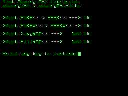

# MSX Memory SDCC Libraries (fR3eL Project)

<table>
<tr><td rowspan=2>Name</td><td>memory_Z80</td></tr>
<tr><td>memory_Slots_MSX</td></tr>
<tr><td>Architecture</td><td>MSX</td></tr>
<tr><td>Environment</td><td>ROM, MSX BASIC or MSX-DOS</td></tr>
<tr><td>Format</td><td>SDCC Relocatable object file (.rel)</td></tr>
<tr><td>Compiler</td><td>SDCC v4.4</td></tr>
<tr><td>License</td><td><a href="LICENSE">MIT license</a></td></tr>
</table>

 

---

## Description

C function library for accessing Z80 memory and slots/subslots on MSX computers.

This project provides two libraries for accessing the memory of MSX systems:
- **memory_Z80.rel** provides you with functions to read or write to the memory. 
- **memory_Slots_MSX.rel** allows you to configure the pages of the slots and subslots.

You can use these libraries to develop applications for ROM, MSXBASIC or MSX-DOS environments, using the Small Device C Compiler [(SDCC)](http://sdcc.sourceforge.net/) cross compiler.

You can access the documentation here with [`How to use the library`](docs/HOWTO.md).

These libraries are part of the [MSX fR3eL Project](https://github.com/mvac7/SDCC_MSX_fR3eL).

This project is open source under the [MIT license](LICENSE).
You can add part or all of this code in your application development or include it in other libraries/engines.

Enjoy it!   

 

---

## History of versions

### memory_Z80.rel
- v1.4 (10/12/2024) Page management has been removed and added to a new library (memory_Slots_MSX.rel).

### memory_Slots_MSX.rel
- v1.4 (10/12/2024) memory_MSX has been divided into two libraries: memory_Z80 and memory_Slots_MSX. This library contains only the paging management of the MSX system.

### memory_MSX.rel (DEPRECATED)
- v1.3 (09/02/2024) Update to SDCC (4.1.12) Z80 calling conventions. Separated into two libraries.
- v1.2 (29/09/2021) Small optimization in PEEK
- v1.1 (28/06/2018) Add slot access functions
- v1.0 (01/03/2016) First version

 

---

## Requirements

- [Small Device C Compiler (SDCC) v4.4](http://sdcc.sourceforge.net/)
- [Hex2bin v2.5](http://hex2bin.sourceforge.net/)

 

---

## Quick Function Guide

See the [How to](docs/HOWTO.md) document for more information and examples.

### memory_Z80 · Read/Write Memory

| Name  | Declaration  | Output | Description |
| :---  | :---         | :---   | :---        |
| PEEK  | `PEEK(address)`  | `char` | Read a 8 bit value from the memory |
| PEEKW | `PEEKW(address)` | `unsigned int` | Read a 16 bit value from the memory |
| POKE  | `POKE(address,value)`  | - | Write an 8 bit value in RAM   |
| POKEW | `POKEW(address,value)` | - | Write an 16 bit value in RAM  |
| CopyRAM | `CopyRAM(source, destination, length)` | - | Copy a block of memory to another address |
| FillRAM | `FillRAM(address,length,value)` | - | Fills an area of the RAM with a value |

 

### memory_Slots_MSX · Manage to memory pages

| Name  | Declaration  | Output | Description |
| :---  | :---         | :---   | :---        |
| GetSlotFromPage | `GetSlotFromPage(page)` | `char` | Returns the slot number of the indicated page  |
| SetPageSlot | `SetPageSlot(page, slot)` | - | Set a slot on the indicated page  |
| IsSlotExpanded | `IsSlotExpanded(slot)` | `char` or deftype `boolean` | Returns if the slot is of the expanded type  |
| GetSubslotFromPage | `GetSubslotFromPage(page)` | `char` | Returns the Subslot number of the indicated page (For expanded slots)  |
| SetPageSubslot | `SetPageSubslot(page, subslot)` | - | Set a subslot on the indicated page (For expanded slots)  |

 

---

## Code Examples

The project includes several examples that I have used to test the library and that can help you learn how to use this library.

You can find them in the [`examples/`](examples/) folder.

 

### Test_mem

Test memory_Z80 and memory_Slots_MSX Libraries.

Format: `MSX 8K ROM`

[`Sourcecode`](examples/Test_mem)

 

---

## Documentation

- The MSX Red Book - [1. Programmable Peripheral Interface](https://github.com/gseidler/The-MSX-Red-Book/blob/master/the_msx_red_book.md#chapter_1)
- Wiki > [Slots](https://www.msx.org/wiki/Slots) `MSX Resource Center`
- MSX I/O ports > [Programmable Peripheral Interface](https://map.grauw.nl/resources/msx_io_ports.php#ppi) `MSX Assembly Page`
- [Primary slots and secondary slots](https://www.msx.org/forum/semi-msx-talk/emulation/primary-slots-and-secondary-slots) (forum discussion) `MSX Resource Center`